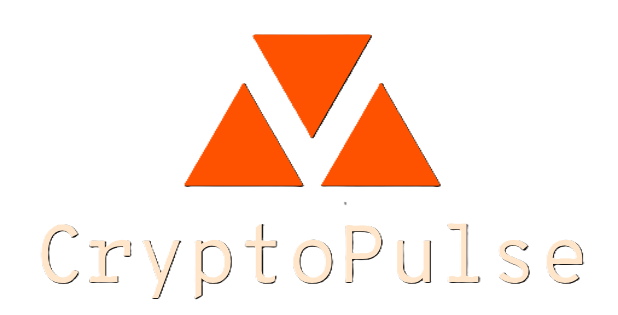

<div align="center">

# CryptoPulse



### Real-Time Cryptocurrency Dashboard

[](https://nodejs.org/)
[](https://expressjs.com/)
[](https://www.chartjs.org/)
[](LICENSE)
[](https://vercel.com/)

**Empowering investors with real-time cryptocurrency market data, interactive visualizations, and comprehensive portfolio insights in a single, user-friendly interface.**

[View Demo](https://cryptipulse.vercel.app) | [Report Bug](https://github.com/Emp1500/cryptipulse/issues) | [Request Feature](https://github.com/Emp1500/cryptipulse/issues)

</div>

---

## Table of Contents

- [Features](#features)
- [Tech Stack](#tech-stack)
- [Architecture](#architecture)
- [Installation](#installation)
- [Usage](#usage)
- [API Endpoints](#api-endpoints)
- [Project Structure](#project-structure)
- [Contributing](#contributing)
- [Roadmap](#roadmap)
- [License](#license)

---

## Features

| Feature | Description |
|---------|-------------|
| **Real-Time Market Data** | View top 12 cryptocurrencies by market cap with live price updates every 60 seconds |
| **Interactive Charts** | Visualize market trends with Chart.js-powered line charts for BTC, ETH, BNB, and XRP |
| **Server-Side Caching** | 5-minute cache layer reduces API calls and ensures fast, responsive performance |
| **Markets Overview** | Browse top 100 cryptocurrencies with rank, price, market cap, and volume data |
| **News Integration** | Direct links to the latest cryptocurrency news from CoinMarketCap |
| **Lottie Animations** | Smooth blockchain-themed animations for enhanced user experience |
| **Responsive Design** | Mobile-first design with Bootstrap 5 and Tailwind CSS |

---

## Tech Stack

<div align="center">

### Backend


### Frontend


### APIs & Deployment


</div>

---

## Architecture

```
┌─────────────────────────────────────────────────────────────────────────┐
│                              CLIENT                                      │
│                    (Browser / EJS Templates)                            │
└─────────────────────────────┬───────────────────────────────────────────┘
                              │ HTTP Request
                              ▼
┌─────────────────────────────────────────────────────────────────────────┐
│                         EXPRESS SERVER                                   │
│                           (app.js)                                       │
│  ┌─────────────────────────────────────────────────────────────────┐   │
│  │                      CACHING LAYER                               │   │
│  │  ┌───────────┐    ┌──────────────────┐    ┌─────────────────┐  │   │
│  │  │  Request  │───▶│   Cache Check    │───▶│   Cache Valid?  │  │   │
│  │  └───────────┘    │   (5-min TTL)    │    └────────┬────────┘  │   │
│  │                   └──────────────────┘             │            │   │
│  │                          ▲                    YES  │  NO        │   │
│  │                          │                    ┌────┴────┐       │   │
│  │                          │                    ▼         ▼       │   │
│  │                   ┌──────┴──────┐      ┌──────────┐ ┌────────┐ │   │
│  │                   │   Update    │◀─────│  Return  │ │ Fetch  │ │   │
│  │                   │   Cache     │      │  Cached  │ │  API   │ │   │
│  │                   └─────────────┘      └──────────┘ └────┬───┘ │   │
│  └──────────────────────────────────────────────────────────│─────┘   │
└─────────────────────────────────────────────────────────────│─────────┘
                                                              │
                                                              ▼
                              ┌────────────────────────────────────────┐
                              │           COINGECKO API                │
                              │    /coins/markets?vs_currency=usd      │
                              └────────────────────────────────────────┘
```

### Data Flow

1. **Client Request** - User navigates to the dashboard
2. **Cache Check** - Server checks in-memory cache validity (5-minute TTL)
3. **Cache Hit** - Valid cached data is served immediately
4. **Cache Miss** - Fresh data is fetched from CoinGecko API
5. **Fallback** - On API failure, stale cache data is served for resilience

---

## Installation

### Prerequisites

- [Node.js](https://nodejs.org/) (v18 or higher)
- [npm](https://www.npmjs.com/) or [yarn](https://yarnpkg.com/)
- Git

### Quick Start

```bash
# Clone the repository
git clone https://github.com/Emp1500/cryptipulse.git

# Navigate to project directory
cd cryptipulse

# Install dependencies
npm install

# Start the development server
npm run dev

# Or start production server
npm start
```

The application will be available at `http://localhost:3000`

---

## Usage

### Development Mode

```bash
npm run dev
```
Starts the server with hot-reload using Nodemon.

### Production Mode

```bash
npm start
```
Starts the server in production mode.

### Pages

| Page | URL | Description |
|------|-----|-------------|
| Dashboard | `/` | Main page with top 12 cryptocurrency cards |
| Markets | `/markets` | Full market data table with 100 cryptocurrencies |
| Charts | `/graphs` | Interactive price charts for BTC, ETH, BNB, XRP |
| About | `/about` | Project information and tech stack |
| News | `/news` | Redirects to CoinMarketCap headlines |

---

## API Endpoints

| Method | Endpoint | Description |
|--------|----------|-------------|
| `GET` | `/` | Renders dashboard with cryptocurrency data |
| `GET` | `/home` | Redirects to main dashboard |
| `GET` | `/graphs` | Renders interactive charts page |
| `GET` | `/markets` | Renders markets data table |
| `GET` | `/about` | Renders about page |
| `GET` | `/news` | Redirects to CoinMarketCap news |

---

## Project Structure

```
cryptipulse/
├── app.js                    # Main server (routes, caching, middleware)
├── package.json              # Dependencies and scripts
├── vercel.json               # Vercel deployment config
├── .gitignore                # Git ignore rules
│
├── public/                   # Static assets
│   ├── css/
│   │   ├── styles.css        # Main styling
│   │   ├── chart.css         # Chart-specific styles
│   │   ├── markets.css       # Markets page styles
│   │   ├── about.css         # About page styles
│   │   └── other.css         # Additional styles
│   ├── js/
│   │   └── markets.js        # Client-side market data
│   ├── images/
│   │   ├── cryptologo.png    # Logo assets
│   │   └── exchange.svg      # Exchange icons
│   └── animations/
│       ├── blockchain.json   # Lottie animations
│       ├── coins.json
│       └── network.json
│
└── views/                    # EJS templates
    ├── index.ejs             # Homepage template
    ├── graphs.ejs            # Charts page template
    └── partials/
        ├── header.ejs        # Navigation header
        ├── footer.ejs        # Footer component
        ├── markets.ejs       # Markets page
        └── about.ejs         # About page
```

---

## Contributing

Contributions are welcome! Follow these steps to contribute:

### Getting Started

1. **Fork the repository**
   ```bash
   # Click "Fork" on GitHub, then clone your fork
   git clone https://github.com/YOUR_USERNAME/cryptipulse.git
   ```

2. **Create a feature branch**
   ```bash
   git checkout -b feature/amazing-feature
   ```

3. **Make your changes**
   - Follow existing code style
   - Add comments for complex logic
   - Update documentation if needed

4. **Commit your changes**
   ```bash
   git commit -m "feat: add amazing feature"
   ```

   Follow [Conventional Commits](https://www.conventionalcommits.org/):
   - `feat:` New features
   - `fix:` Bug fixes
   - `docs:` Documentation changes
   - `style:` Code style changes
   - `refactor:` Code refactoring

5. **Push to your fork**
   ```bash
   git push origin feature/amazing-feature
   ```

6. **Open a Pull Request**
   - Provide a clear description of changes
   - Reference any related issues

### Code Style

- Use 2-space indentation
- Use meaningful variable names
- Keep functions small and focused
- Add JSDoc comments for public functions

---

## Roadmap

- [ ] **Real-Time Updates** - WebSockets/SSE for live data streaming
- [ ] **User Accounts** - Save favorite cryptocurrencies and preferences
- [ ] **Advanced Charts** - Technical indicators (RSI, MACD, Bollinger Bands)
- [ ] **Portfolio Tracker** - Track holdings and calculate gains/losses
- [ ] **Price Alerts** - Notifications for price thresholds
- [ ] **Database Integration** - Redis caching for better scalability
- [ ] **PWA Support** - Offline access and mobile app experience

---

## License

This project is licensed under the **ISC License**.

---

<div align="center">

**Built with passion by [Vedant Wagh](https://github.com/Emp1500)**

[](https://github.com/Emp1500)
[](https://linkedin.com/in/vedantwagh)

If you found this project helpful, please consider giving it a star!

</div>
